<div align="center">

  <br />
  <br />

  

  <h1 style="font-size: 3rem; margin-bottom: 0;">Dynamic On-Chain NFT Engine</h1>

  <p style="font-size: 1.1rem; color: #b298dc; max-width: 600px;">
    <strong>From static assets to state-aware, living tokens.</strong><br/>
    A dual-contract system demonstrating 100% on-chain SVG rendering and dynamic metadata evolution.
  </p>

  <p>
    <a href="https://github.com/NexTechArchitect/FOUNDRY-Basic-and-Mood-Nft">
      
    </a>
    &nbsp;
    <a href="https://github.com/NexTechArchitect/FOUNDRY-Basic-and-Mood-Nft">
      
    </a>
    &nbsp;
    <a href="https://github.com/NexTechArchitect/FOUNDRY-Basic-and-Mood-Nft">
      
    </a>
  </p>

  <br />

</div>

---

## 📑 Table of Contents

- [🖼️ The Collection Strategy](#-the-collection-strategy)
- [🌐 Live Deployments](#-live-deployments)
- [🧠 Technical Deep Dive](#-technical-deep-dive)
- [🧩 Metadata Architecture](#-metadata-architecture)
- [🎓 Educational Objectives](#-educational-objectives)

---

## 🖼️ The Collection Strategy

This repository houses two distinct implementations, representing the "History" and "Future" of NFT development.

<table width="100%">
  <tr>
    <td width="50%" valign="top">
      <h3 align="center">🐶 BasicNFT</h3>
      <p align="center"><i>"The Foundation (v1)"</i></p>
      <ul>
        <li><b>Type:</b> Static ERC-721.</li>
        <li><b>Storage:</b> Off-chain (IPFS/Centralized).</li>
        <li><b>Concept:</b> A minimal implementation representing the standard PFP (Profile Picture) model used by collections like BAYC.</li>
        <li><b>Focus:</b> Understanding `tokenURI` pointer logic and sequential minting.</li>
      </ul>
    </td>
    <td width="50%" valign="top">
      <h3 align="center">🎭 MoodNFT</h3>
      <p align="center"><i>"The Evolution (v2)"</i></p>
      <ul>
        <li><b>Type:</b> Dynamic & Interactive.</li>
        <li><b>Storage:</b> 100% On-Chain (SVG).</li>
        <li><b>Concept:</b> A stateful NFT that reflects emotion. Owners can execute a transaction to flip the visual state from <code>SAD</code> to <code>HAPPY</code>.</li>
        <li><b>Focus:</b> Base64 encoding, JSON construction in Solidity, and SVG image generation.</li>
      </ul>
    </td>
  </tr>
</table>

---

## 🌐 Live Deployments

Verified contracts deployed on the **Sepolia Testnet**.

| **Collection** | **Contract Address** | **View on Etherscan** |
| :--- | :--- | :--- |
| **BasicNFT** | `0xb41965Bb58aF40c99B1d539e66518bCa16769bf7` | [🔎 Explorer](https://sepolia.etherscan.io/address/0xb41965Bb58aF40c99B1d539e66518bCa16769bf7) |
| **MoodNFT** | `0x01721d6502547faFD3049BE60b1485B12407f58B` | [🔎 Explorer](https://sepolia.etherscan.io/address/0x01721d6502547faFD3049BE60b1485B12407f58B) |

---

## 🧠 Technical Deep Dive

### 1. On-Chain Metadata (MoodNFT)
Unlike traditional NFTs that link to a URL (which can go offline), **MoodNFT** generates its image using code.
* The Smart Contract constructs an **SVG** (Scalable Vector Graphic) string dynamically.
* It utilizes `Base64` encoding to bundle the image and JSON metadata together.
* The browser renders this `data:application/json;base64,...` string directly, ensuring the NFT lives as long as Ethereum exists.

### 2. State Flipping Logic
The NFT has persistent memory. It tracks its current "Mood" enum state.

```solidity
// Simplified Logic
function flipMood(uint256 tokenId) public {
    // Only the owner can flip the mood
    if (!_isApprovedOrOwner(msg.sender, tokenId)) {
        revert MoodNft__CantFlipMoodIfNotOwner();
    }

    if (s_tokenState[tokenId] == Mood.HAPPY) {
        s_tokenState[tokenId] = Mood.SAD;
    } else {
        s_tokenState[tokenId] = Mood.HAPPY;
    }
    // The tokenURI() function reads this state to decide which SVG to render!
}

```

---

## 🧩 Metadata Architecture

The **MoodNFT** does not use IPFS. Instead, it constructs the JSON response entirely within the Solidity smart contract using OpenZeppelin's `Base64` library.

```mermaid
graph LR
    Contract[Smart Contract]
    State{Check Mood State}
    SVG[Generate SVG Code]
    Base64[Base64 Encode]
    JSON[Construct JSON]
    URI[Final Data URI]

    Contract --> State
    State -- Happy --> SVG
    State -- Sad --> SVG
    SVG --> Base64
    Base64 -- "image_data" --> JSON
    JSON --> Base64
    Base64 --> URI
    
    style Contract fill:#2d1b4e,stroke:#9d4edd,stroke-width:2px
    style State fill:#1a1a1a,stroke:#b298dc
    style SVG fill:#1a1a1a,stroke:#fff

```



> **Result:** A fully decentralized, permanent NFT that exists solely as code on the blockchain.

---

## 🎓 Educational Objectives

This project was built to master the core competencies of a Senior Smart Contract Engineer:

* [x] **ERC-721 Standards:** Implementing `tokenURI`, `ownerOf`, and `approve` flows manually.
* [x] **Low-Level Encoding:** Using `Base64` libraries to handle string manipulation in Solidity.
* [x] **Gas Optimization:** Storing SVG parts as `constant` or `immutable` to reduce deployment costs.
* [x] **Testing Mastery:** Writing unit tests to verify that the generated Base64 strings decode into valid JSON.

---

<div align="center">


<b>Engineered by NEXTECHARHITECT</b>


<i>Smart Contract Developer · Solidity · Foundry · Web3 Engineering</i>


<a href="https://github.com/NexTechArchitect">GitHub</a> •
<a href="https://www.google.com/search?q=https://twitter.com/NexTechArchitect">Twitter</a>
</div>

```

```
