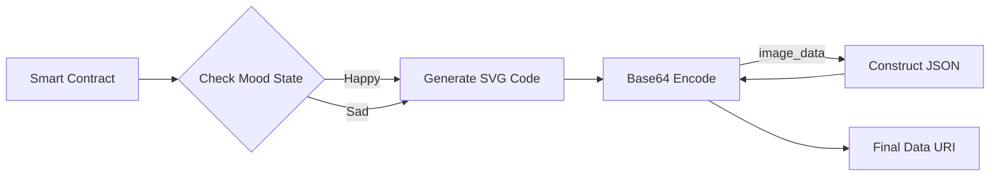

<div align="center">
  

  <br/>

  <p>
    <a href="https://github.com/NexTechArchitect/FOUNDRY-Basic-and-Mood-Nft">
      
    </a>
    
  </p>

  <h3>🎭 A Dual-Contract Exploration of Digital Ownership</h3>
  <p width="80%">
    <b>From static assets to dynamic, living tokens.</b><br/>
    This project demonstrates the evolution of NFTs, featuring a classic IPFS implementation alongside a fully dynamic, on-chain SVG engine.
  </p>

  <br/>

  <h3>🎨 Collection Navigation</h3>
  <p>
    <a href="#-the-collection"><strong>🖼 The Collection</strong></a> &nbsp;|&nbsp;
    <a href="#-technical-deep-dive"><strong>🧠 Deep Dive</strong></a> &nbsp;|&nbsp;
    <a href="#-live-deployments"><strong>🌐 Networks</strong></a> &nbsp;|&nbsp;
    <a href="#-metadata-architecture"><strong>🧩 Metadata</strong></a> &nbsp;|&nbsp;
    <a href="#-educational-objectives"><strong>🎓 Objectives</strong></a>
  </p>

</div>

---

## 🖼 The Collection

This repository houses two distinct implementations, representing the "History" and "Future" of NFT development.

<table width="100%">
  <tr>
    <td width="50%" valign="top">
      <h3 align="center">🐶 BasicNFT</h3>
      <p align="center"><i>"The Foundation"</i></p>
      <ul>
        <li><b>Type:</b> Static ERC-721.</li>
        <li><b>Storage:</b> Off-chain (IPFS/Centralized).</li>
        <li><b>Concept:</b> A minimal implementation representing the standard PFP (Profile Picture) model.</li>
        <li><b>Key Lesson:</b> Understanding `tokenURI` pointer logic and sequential minting.</li>
      </ul>
    </td>
    <td width="50%" valign="top">
      <h3 align="center">🎭 MoodNFT</h3>
      <p align="center"><i>"The Evolution"</i></p>
      <ul>
        <li><b>Type:</b> Dynamic & Interactive.</li>
        <li><b>Storage:</b> 100% On-Chain (SVG).</li>
        <li><b>Concept:</b> A stateful NFT that reflects emotion. Owners can flip the state from <code>SAD</code> to <code>HAPPY</code>.</li>
        <li><b>Key Lesson:</b> Base64 encoding, JSON construction in Solidity, and SVG image generation.</li>
      </ul>
    </td>
  </tr>
</table>

---

## 🌐 Live Deployments (Sepolia)

Verified contracts deployed on the Sepolia Testnet.

| **Collection** | **Contract Address** | **View on Etherscan** |
| :--- | :--- | :--- |
| **BasicNFT** | `0xb41965Bb58aF40c99B1d539e66518bCa16769bf7` | [🔎 Explorer](https://sepolia.etherscan.io/address/0xb41965Bb58aF40c99B1d539e66518bCa16769bf7) |
| **MoodNFT** | `0x01721d6502547faFD3049BE60b1485B12407f58B` | [🔎 Explorer](https://sepolia.etherscan.io/address/0x01721d6502547faFD3049BE60b1485B12407f58B) |

---

## 🧠 Technical Deep Dive

### 1. On-Chain Metadata (MoodNFT)
Unlike traditional NFTs that link to a URL (which can go offline), **MoodNFT** generates its image using code.
* The Smart Contract constructs an **SVG** (Scalable Vector Graphic) string.
* It utilizes `Base64` encoding to bundle the image and JSON metadata together.
* The browser renders this `data:application/json;base64,...` string directly, ensuring the NFT lives as long as Ethereum exists.

### 2. State Flipping Logic
The NFT has memory. It tracks its current "Mood".

```solidity
// Simplified Logic
function flipMood(uint256 tokenId) public {
    if (s_tokenState[tokenId] == Mood.HAPPY) {
        s_tokenState[tokenId] = Mood.SAD;
    } else {
        s_tokenState[tokenId] = Mood.HAPPY;
    }
    // The image URI updates automatically based on this state!
}

```

---

## 🧩 Metadata Architecture

The **MoodNFT** does not use IPFS. Instead, it constructs the JSON response entirely within the Solidity smart contract.



> **Result:** A fully decentralized, permanent NFT that exists solely as code on the blockchain.

---

## 🎓 Educational Objectives

This project was built to master the core competencies of a Senior Smart Contract Engineer:

* [x] **ERC-721 Standards:** Implementing `tokenURI`, `ownerOf`, and `approve` flows manually.
* [x] **Low-Level Encoding:** Using `Base64` libraries to handle string manipulation in Solidity.
* [x] **Gas Optimization:** Storing SVG parts as `constant` or `immutable` to reduce deployment costs.
* [x] **Testing Mastery:** Writing unit tests to verify that the generated Base64 strings decode into valid JSON.

---

<div align="center">


<h3>Engineered by NexTechArchitect</h3>
<p><i>Smart Contract Developer • Solidity • Web3 Engineering</i></p>


<a href="https://github.com/NexTechArchitect">

</a>
&nbsp;&nbsp;
<a href="https://linkedin.com/in/amit-kumar-811a11277">

</a>
&nbsp;&nbsp;
<a href="https://x.com/itZ_AmiT0">

</a>

</div>

```

```
